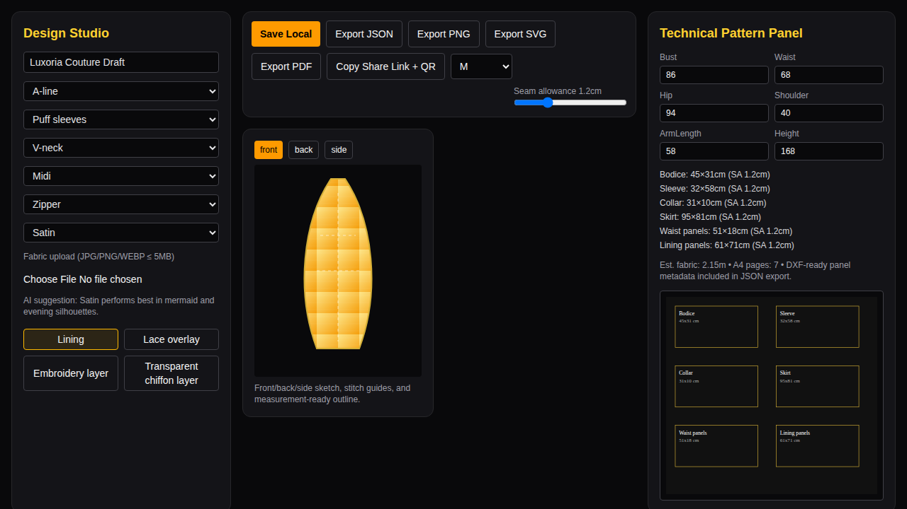

# Luxoria AI Fashion Designer

Luxury-grade offline-first AI fashion design studio for couture consultations and technical tailoring workflows.

## Project Overview

Luxoria AI Fashion Designer combines garment configuration, fabric visualization, pattern panel generation, technical sketching, and export workflows in one local-first web app.

## Screenshots

Main studio UI screenshot (generated from local run):



## Installation

```bash
npm install
npm run dev
```

Open `http://localhost:3000`.

## Offline Setup

- PWA manifest: `public/manifest.webmanifest`
- Service worker cache: `public/sw.js`
- Local project persistence: Zustand localStorage + IndexedDB (`Dexie`)

After first load, core app shell and key assets remain available offline.

## Deployment Guide

### GitHub Pages / Vercel / Netlify

- Build command: `npm run build`
- Start command: `npm run start`

### Docker

```bash
docker compose up --build
```

## Tech Stack

- Next.js + React + TypeScript + Tailwind CSS
- Zustand state management
- Three.js (React Three Fiber + drei)
- Dexie (IndexedDB)
- Framer Motion
- Vitest + Playwright

## Architecture Diagram

```txt
UI Studio
 ├─ Designer Configurator (silhouette/neckline/sleeves/layers)
 ├─ Fabric Engine (upload + validation + texture mapping)
 ├─ 2D Technical Sketch (front/back/side + stitch guides)
 ├─ Pattern Generator (parametric panel sizing + seam allowance)
 ├─ 3D Viewer (mannequin + orbit controls)
 └─ Export Layer (JSON/SVG/PNG/PDF fallback + share QR)

Persistence
 ├─ localStorage (session state)
 └─ IndexedDB (saved projects)

Offline
 ├─ Service Worker cache
 └─ PWA manifest/installability
```

## Future Roadmap

- ONNX/TensorFlow.js style model recommendations
- AR try-on and body estimation
- Multi-user collaboration and annotation workflow
- Cost/yardage optimizer with inventory sync

## Environment Variables

Copy from `.env.example` for optional free-tier integrations.

## License

Apache-2.0
